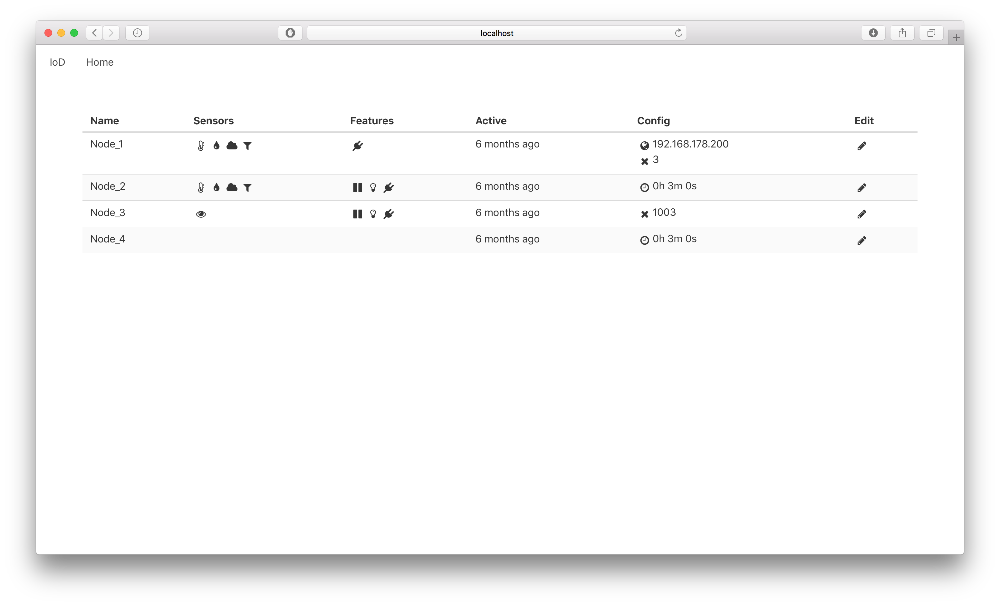
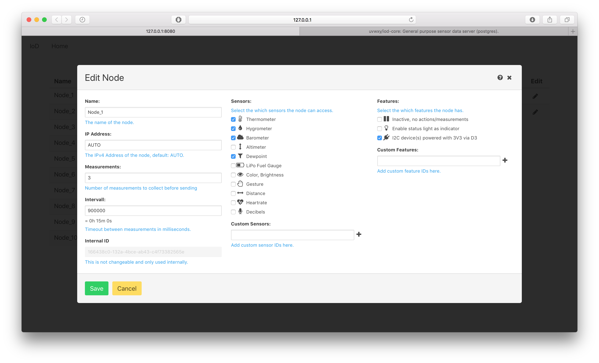
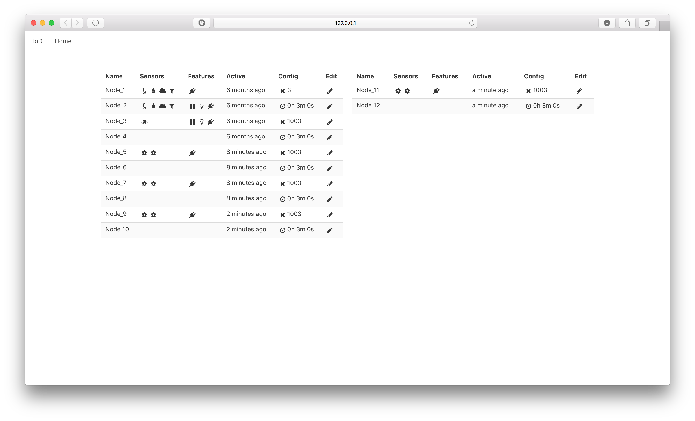
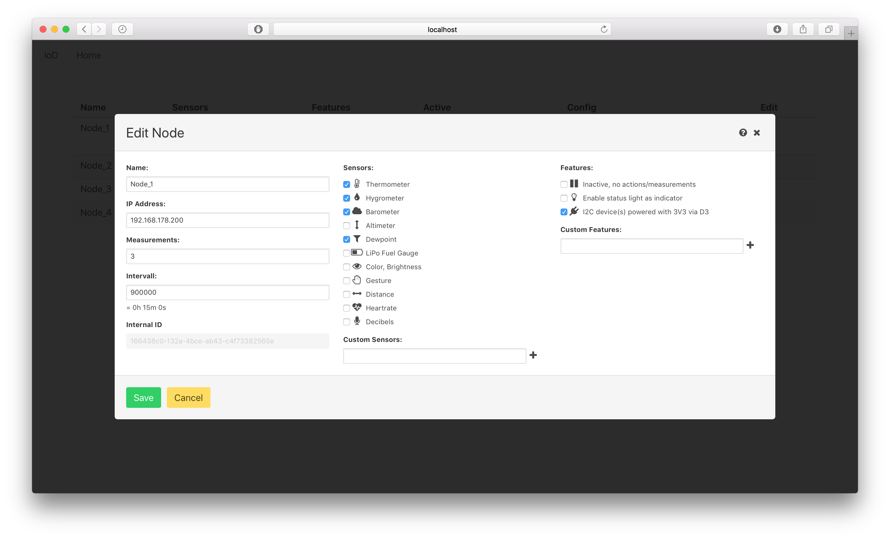

# IoD Core

The goal of this project is to have a general purpose sensor data server. Often I add a bunch of sensors to an Arduino (ESP8266) and want to log the data. My goal is to have a single firmware that you just need to point to your local server. Once the client appears in the server you can select which sensors (mostly I2C) are solderd to the Arduino and select at which intervall which sensors should be submitted to the database. 

The data is then visualized with [grafana](https://grafana.com), because they already figured out how to write an awesome UI to display data.

See work in progress below:






## TODO
- Write the client
- Configure Grafana
- Precompile RaspberryPi docker images
- More documentation

(Hint: the remaining documentation is aimed at developers)

This project contains the Internet of Dingens (IoD) backend. It's a server (`src/server/`) written with NodeJS that provides a REST api for clients to store sensor data, which is stored in a PostGRE database. The frontend (`src/ui`) is written with React and Typescript utilizing components from bloomer.js (bulma css).

## Technologies
Stuff you need to know if you want to build or run this:

- [Docker Community Edition](https://www.docker.com/community-edition)
- [Docker Commpose](https://docs.docker.com/compose/)
- [PostgreSQL](https://www.postgresql.org)
- [TypeORM](http://typeorm.io/#/)
- [NodeJS (latest LTS)](https://nodejs.org)
- [ReactJS](https://reactjs.org)
- [bloomer.js](https://bloomer.js.org/#/)
- [BulmaCSS](https://bulma.io)
- [WebPack](https://webpack.github.io)
- [GNU Make](https://www.gnu.org/software/make/)
- [Mocha](https://mochajs.org)
- [iod-rpibakery-config](https://github.com/uvwxy/iod-rpibakery-config) (for later installation of precompiled docker images)

You might try without previous knowledge, but running into undocumented steps is highly likely. Please add an issue if you do so.

## Developer quick start (a.k.a. "I just want to test it locally")

#### 1) build the docker database image
```bash
cd docker/images/iod-database
make
```

#### 2) start the database with docker-compose
```bash
cd docker/services/iod-dev-db
docker-compose up -d
```

#### 3) build the frontend
```bash
npm install
npm run build # this will temporarily start a dev backend and and insert devices into the DB
```

#### 4) start the server
```bash
npm run dev # will restart the server on recompile
> iod-core@0.0.1 dev /Users/paul/Code/repo/iod-core
> nodemon lib/server/index.js

[nodemon] 1.14.3
[nodemon] to restart at any time, enter `rs`
[nodemon] watching: *.*
[nodemon] starting `node lib/server/index.js`
Starting...
Connected to DB...
Server started.
Started IoD-Core on 0.0.0.0:8080
URL: http://127.0.0.1:8080
```

Login with `admin`:`admin`.

#### 5) make changes
Make changes and keep the typescript compiler running in the background:
``` bash
./node_modules/.bin/tsc -w
```

## Production quick start (a.k.a "I want to run it somewhere permanently")

#### 1) build the images
```bash
cd docker/images/iod-database
make
cd ../iod-core/
make
```

#### 2) setup secrets
```bash
cd docker/services/iod-prod
bash setup_secrets.sh # dont use in production :P
```

#### 3) start the prod db + server
```bash
cd docker/services/iod-prod
docker-compose up -d
```

## Writing IoD Nodes

Clients need to follow the protocol to be added into the monitoring system, and send monitoring data:

0) Boot/Wakeup
1) Check if node has a UUID
    * **no:** create a UUID and store it locally, *go to 2.*
    * **yes:** *go to 2.*
2) Check if there is a local config:
    * **no:** Create/Request a default config form iod-codre: `POST /api/node/$UUID/config`
        * **success:** send node to configured sleep
        * **error:** send node to sleep for 3 minutes
    * **yes:** Read local config
        * **activeFeatures:** behave according to features
        * **activeSensors:** for each sensor, measure its value
        * **numberOfSamples** check if this is reached
            * **no:** cache values and sleep for **sleepTimeMillis**
            * **yes:** send  data
                * **ipv4address:** if this is not "AUTO" use specified address
                * request new config, if it has changed (ignoring timestamps), store it.
                * sleep for **sleepTimeMillis**

Details on this protocol's API can be taken from `src/test/01-NodeConfigController.spec` and `srtc/test/02-NodeValuesController.spec`.

#### Example config response
```json
{
    "id": "a5964d44-8845-48dd-8d91-5028f8dca66e",
    "dataId": 2,
    "name": "Node_2", // our name
    "lastSeen": 1517141593943, // unix timestamp
    "firstSeen": 1517141592428, // unix timestamp
    "numberOfSamples": 1,
    "sleepTimeMillis": 180000, // 1000*60*3 = 3 minutes
    "activeSensors": [ // list of sensor IDs
        "BME280_TEMP",
        "BME280_HYGRO",
        "BME280_BARO",
        "BME280_DEW"
    ],
    "activeFeatures": [ // list of features to enable
        "I2C_DEVICE_ON_D3"
    ],
    "ipv4address": "192.168.178.200" // could be "AUTO"
}
```
Which responds to

Note, the frontend as well as the clients share the same REST endpoints. This makes it easier to develop.
